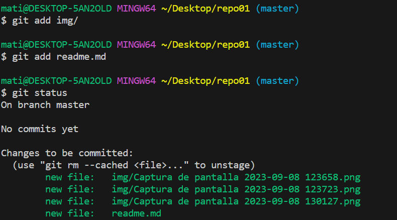
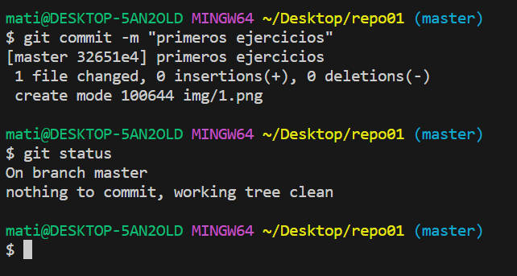
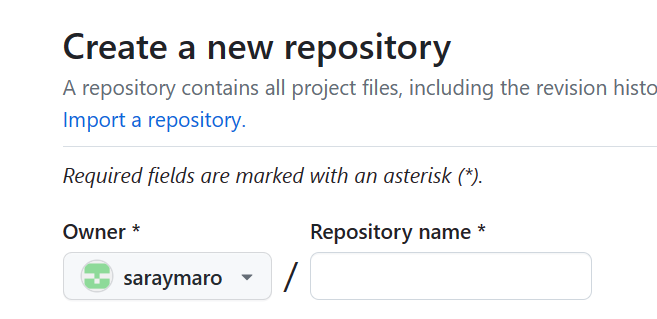
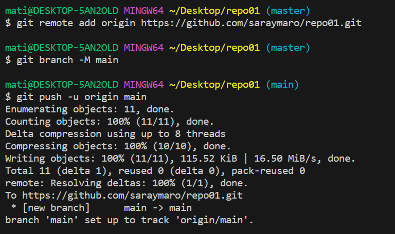
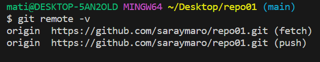
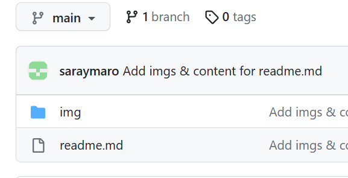
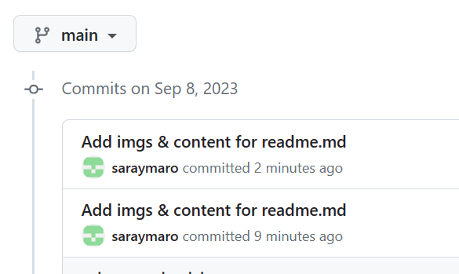

# Ejercicios

– Crea un directorio llamado repo01 en local (desde tu máquina) e ejecuta el comando
pertinente para que dicho directorio para que se transforme el repositorio en local ¿Cómo podemos
identificar que el repositorio se ha inicializado?
> 
> 
> Hacemos mkdir para crear el directorio, git init para iniciarlo y entramos en el repositorio, como se puede comprobar ya estamos en la rama master.

 Añade un documento llamado readme.md dentro del repositorio (recuerda que MD es la
extensión de los ficheros Markdown) y documenta en su interior todos los pasos que vas realizando para
crear un repositorio, etc. Puedes añadir fotos o lo que creas conveniente
> 
> Creamos el readme.md para que sea un documento Markdown y empezamos a editarlo.

Añade el fichero que acabamos de añadir al repositorio al staging area, visualiza el estado del
repositorio (con git status) y haz un snapshot (commit) del fichero hacía nuestro repositorio local. ¿En que “file status lifecycle” se encuentra el fichero?
> 
> Lo añadimos al stating area haciendo git add y luego miramos el git status para ver el estado y comprobarlo.
> 
> Hacemos commit y miramos el estado con git status, vemos que esta en la rama master y que no hay nada nuevo para hacer commit. 

Intenta subir los ficheros al repositorio remoto mediante al comando git push ¿Se te ocurre que está pasando? (si no lo sabes aún no te preocupes)
Ejecuta el comando git remote –v e investiga porque no nos aparece nada

>No nos aparecía nada porque no habíamos creado el repositorio en github.

Crea un repositorio remoto llamado repo01, asócialo a tu repositorio local
>
Creamos el repositorio en github.
>
Hacemos push con el repositorio que hemos creado.

Vuelve a ejecutar el comando git remote –v nuevamente y explica el porque ahora si que aparece
>
>Ahora nos aparece porque se ha hecho correctamente.

Sube los cambios que hemos subido al snapshot local (commit) hacía al repositorio remoto.  Ves al repositorio remoto (en este caso GitHub) y comprueba que se haya realizado el commit
correctamente y observa que pasa en el repositorio ¿Observas algo peculiar?
>
>
Observamos que se ha hecho y vemos que se han efectuado los commits.

